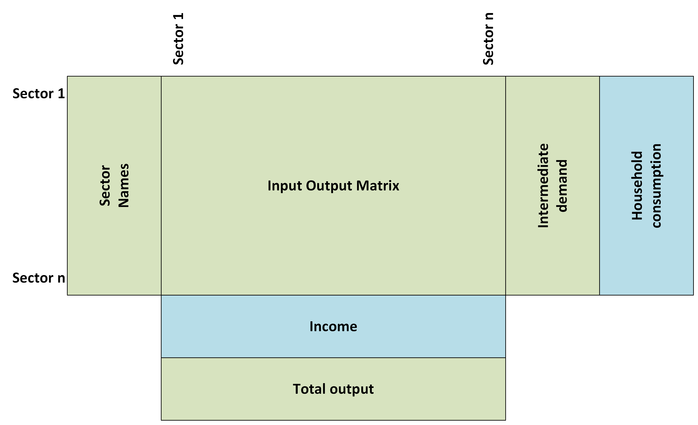

# iot-leontief-python

A Python package to perform Type 1 and Type 2 Leontief Inverse Input Output Modelling in Python.

Those wishing to familiarise themselves with input output analysis are directed to [Miller & Blair (2009)](http://digamo.free.fr/io2009.pdf).

## Getting Started

1. Clone the repository:

```
git clone https://github.com/wgdsu/iot-leontief-python.git
```

2. Install dependencies:

```
cd iot-leontief-python
pip install -r requirements.txt
```

3. Install the package:

```
pip install .
```

## Running the example

To help you get started, we include an `example.py` script in the repository.

The example uses fictitious data contained in `data/iot_example.csv`.

To run the example:

```
python example.py
```

This will print out an example of a modelled scenario using the `data/iot_example.csv`.

## Using your own data

The package can be used for analysis on your input output data.

Your data needs to be formatted with:
* Sector Names: The first column containing sector codes or names
* Input Output Matrix: A square input output matrix
* Intermediate Demand: A row at the end of the matrix that gives the sum across columns in the square matrix (total intermediate use)
* Total Output: The final row that contains the total output (IO matrix + exports + final demand)
* If you wish to perform Type 2 modelling:
  * Household Consumption: A column that comes after the IO matrix containing the household final demand by sector
  * Income: A row that comes after the IO matrix containing the labour input (income) by sector

The components and their positions are labelled in the diagram below and an example is provided in the file `data/iot_example.csv`.



The `data/iot_example.csv` shows an example of this formatting.

The `data/iot_example.csv` shows an example of this formatting.

The example.py script must be adapted to your data:

```python
import pandas as pd
from iot_leontief_python.multipliers import *

# Read in example data
df = pd.read_csv('data/iot_example.csv') # replace with path to your input output data

# Split datasets
output, sectors, disposable_income, hh_demand, io_matrix = get_components(
        df,
        "Total intermediate use", # replace with your intermediate demand column name
        "Total output at basic prices", # replace with your total output row name
        "Industry Purchases ↓  Industry Sales →", # replace with your column that contains sector names
        "Households final consumption expenditure", # replace with your household final demand column name
        "Compensation of employees" # replace with your labour input (income) name
    )
```
